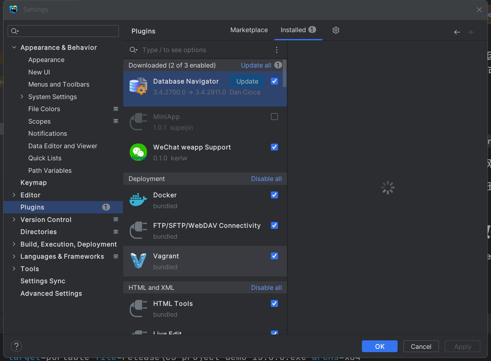

## 概述
一个客户端的单机桌面应用 demo 。

包含内容：
1. 登录界面

2. 主页、菜单栏、右键小菜单显示操作

3. 路由弹窗、数据增删改查


开发时保留了angular热加载的特性。

打包时能实现跨平台打包。

但是注意，各个平台操作系统打的包只能在自己平台上用。

## 环境

基础环境：node v18.17.1 ; nvm v1.1.11

前端框架：angular v16.1.3

封装桌面框架：electron v25.2.0

orm框架：typeorm v0.3.17

数据库：better-sqlite3 v8.7.0

## 如何启动

### 安装依赖

项目有两个`package.json`文件
1. 位于app（`/app`）中的是主进程需要的依赖，`npm install`安装依赖（使用`cnpm install`依赖包的子依赖会放在`node_modules/.store`中，该文件不会被`electron-builder`打包，可能通过设置可以实现打包该内容，问题暂时保留）。
2. 在根目录（`/`）的是angular需要的依赖，在下载`angular(渲染器进程)`需要的依赖时需要使用。`npm install`安装。
3. 安装完成依赖之后需要对主进程的`better-sqlite3`依赖进行重构 (`cd app && ./node_modules/.bin/electron-rebuild -f -w better-sqlite3` ) 。

综上，(根目录下启动终端)安装依赖命令以及顺序为：
```angular2html
npm install --force // 安装根目录下的依赖

cd app

npm install // 安装app下的依赖

./node_modules/.bin/electron-rebuild -f -w better-sqlite3 // 重构better-sqlite3
```

### 根目录下以命令行启动
方式一：`npm install`

方式二：打开两个终端，一个执行`npm run ng:serve`, 另一个执行`npm run electron:serve`

需要注意，初次启动时请使用方式一，似乎是因为第一次需要将 ts 文件编译为 js 文件。初次启动以方式二会报错。

通常开发时以方式二启动更好，因为当修改了主进程时，就只需要重启 electron 即可。

## 打包
根目录下执行`npm run electron:build`

打包后可执行程序位置如下图，双击即可启动。


分发时可以将 win-unpacked 打压缩包发送即可。

## 开发时如何查看数据库

在 webstorm 安装插件 Database Navigator 


安装方法：webstorm 菜单栏 -> file -> setting -> Plugins 搜索安装即可。



然后打开 Database Navigator 。


选择根目录下的 db 中的文件，点击确定（如果找不到该文件，请尝试重启webstorm）。


## 本项目是以下项目的进一步拓展

https://github.com/maximegris/angular-electron

